# poster-pipeline

A small **HTML + CSS → print-ready A3 PDF** build system for poster work at SMARK8ING / Daily Mark8ing. Renders with WeasyPrint, exports at A3 297×420 mm with 3 mm bleed + crop marks + sRGB at PDF/A-3b archival quality.

Each git branch is a separate poster project. `main` ships the first one — a **price card for [Rockwall Fitness](https://rockwallfitness.in), Bangalore** — as a working example.

<p align="center">
  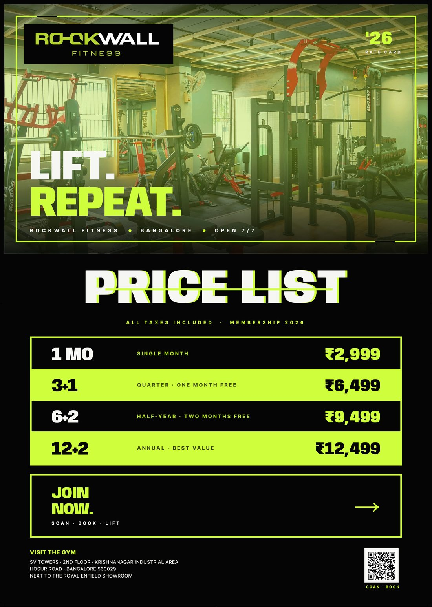
  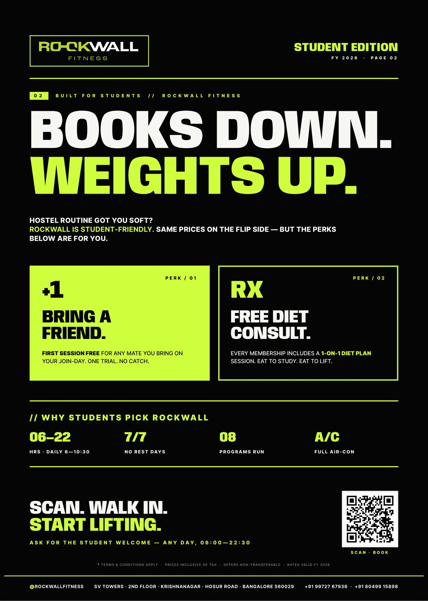
</p>

---

## Table of contents

1. [What this is](#what-this-is)
2. [Build pipeline](#build-pipeline)
3. [Variant exploration](#variant-exploration)
4. [Project structure](#project-structure)
5. [Render commands](#render-commands)
6. [Print export spec](#print-export-spec)
7. [How to start a new poster project](#how-to-start-a-new-poster-project)
8. [Branch-per-project model](#branch-per-project-model)
9. [WeasyPrint gotchas](#weasyprint-gotchas-learned-the-hard-way)
10. [Credits](#credits)

---

## What this is

Print posters are still mostly made in Figma / Illustrator / InDesign — clicking pixels around. This repo proves the alternative: **describe a poster in HTML + CSS, render it to a print-grade PDF in one command.**

Why bother:
- **Versionable.** Every design tweak is a git commit. No `final_v7_REALLY_FINAL.psd`.
- **Parametric.** Update prices in one line, re-render in 2 seconds. No hand-redoing.
- **AI-collaborable.** Claude can edit CSS surgically, generate variants in parallel, and ship 5 polished posters in the time it takes to manually align one.
- **Print-grade output.** Bleed + crop marks + PDF/A-3b — same quality as InDesign export, no design tool required.
- **Pipeline reuse.** The same `build.py` works for every poster project. New client = new branch, swap the assets, ship.

This repo is opinionated about **one client per branch**. The `main` branch holds the seed Rockwall project; future client work lives on its own branch (see [Branch-per-project model](#branch-per-project-model)).

---

## Build pipeline

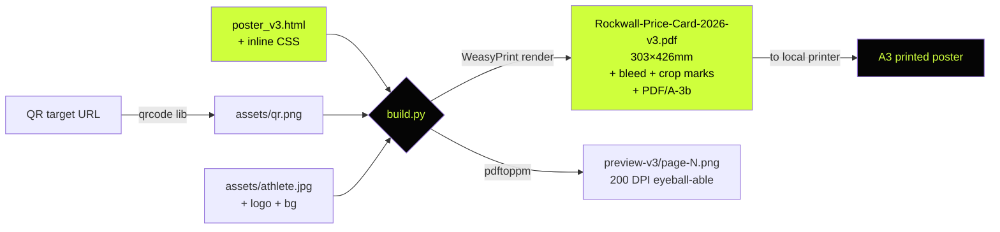

One command (`python3 build.py poster_v3.html`) executes the whole chain.

---

## Variant exploration

This project explored **5 distinct design directions** before landing on v3 as the synthesis pick. The exploration tree:

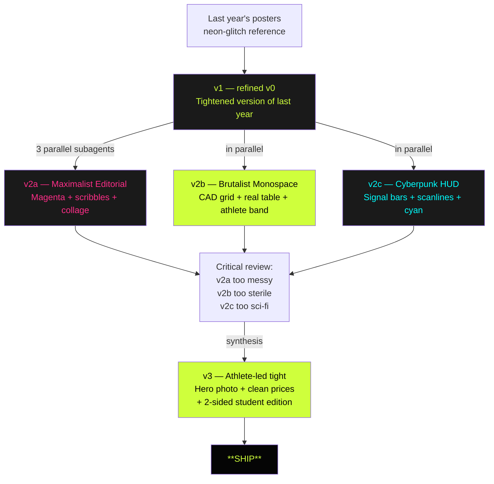

### Gallery

<table>
<tr>
<td width="33%" align="center">
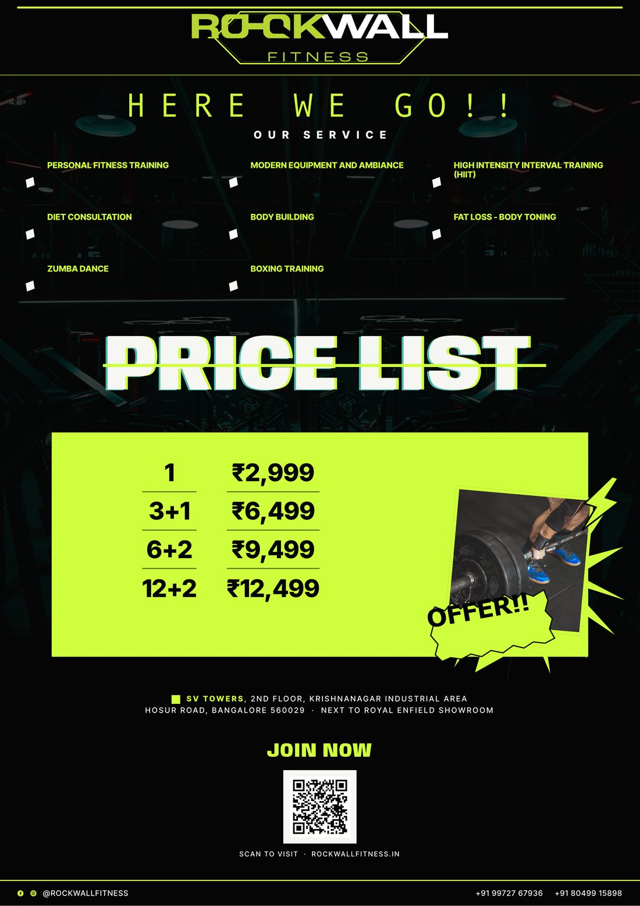<br>
<b>v1 — Refined original</b><br>
<sub>Neon-glitch + sticker hero. Faithful refresh of last year's brand DNA.</sub>
</td>
<td width="33%" align="center">
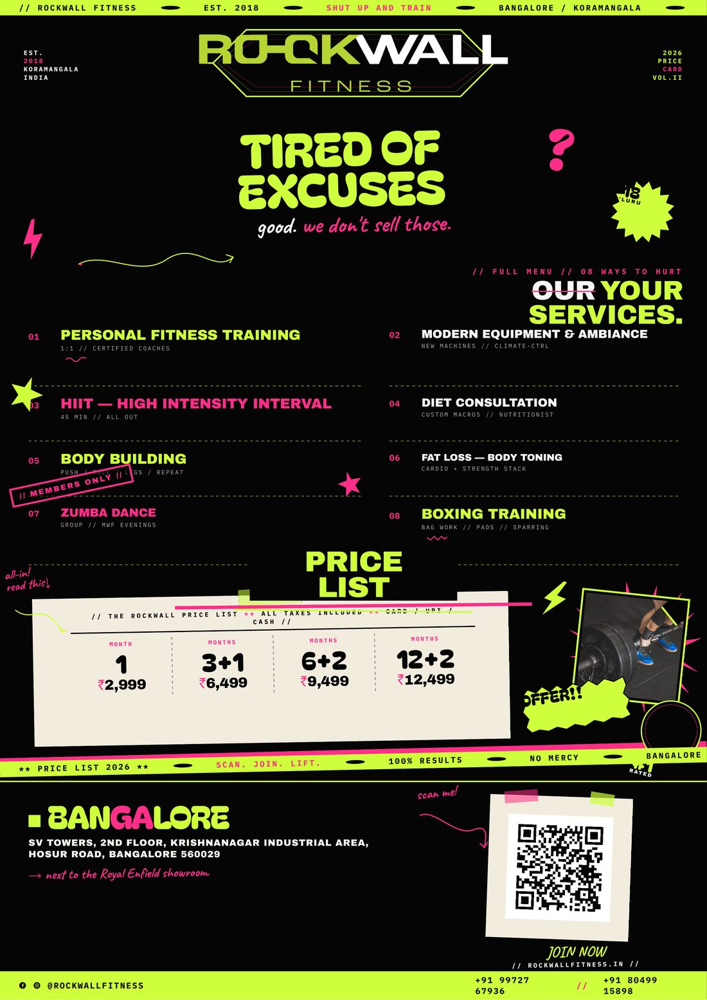<br>
<b>v2a — Maximalist Editorial</b><br>
<sub>Magazine-spread chaos. Magenta spark. Hand-drawn marks + sticker collage.</sub>
</td>
<td width="33%" align="center">
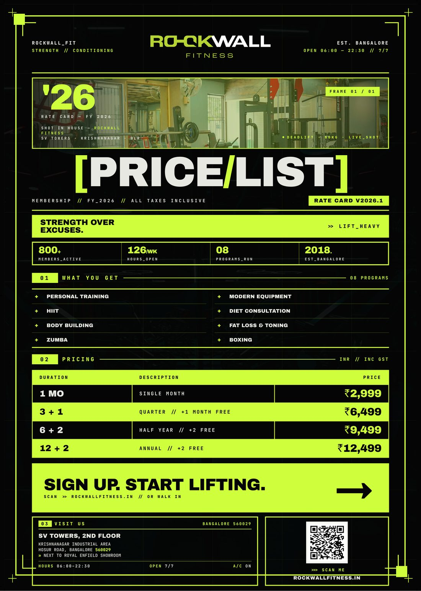<br>
<b>v2b — Brutalist Monospace</b><br>
<sub>CAD-grid + real pricing table + athlete hero band + stats strip. Confident departure.</sub>
</td>
</tr>
<tr>
<td width="33%" align="center">
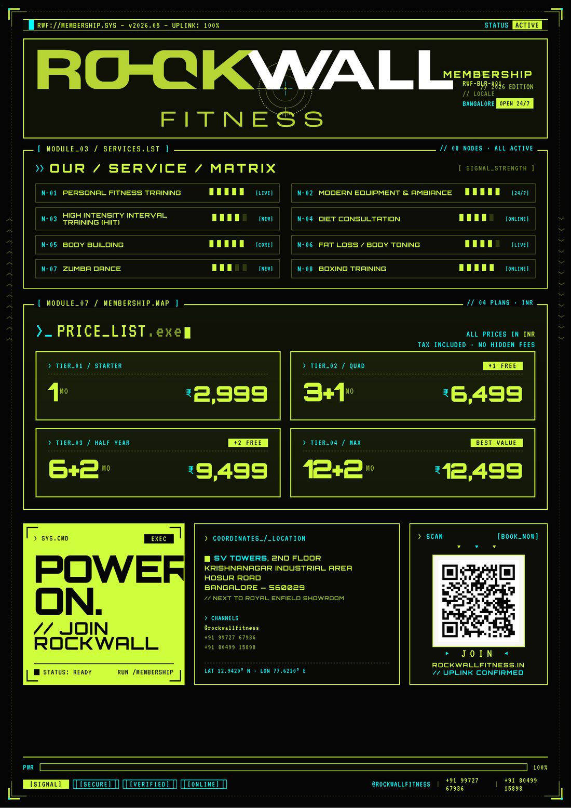<br>
<b>v2c — Cyberpunk HUD</b><br>
<sub>Sci-fi UI overlay. Signal bars + modular price modules + cyan accent.</sub>
</td>
<td width="33%" align="center">
<br>
<b>v3 — Synthesis (front)</b><br>
<sub>Athlete-led hero + clean stacked prices + one CTA. The ship pick.</sub>
</td>
<td width="33%" align="center">
<br>
<b>v3 — Student Edition (back)</b><br>
<sub>2-sided. "BOOKS DOWN. WEIGHTS UP." + bring-a-friend perk + free diet consult.</sub>
</td>
</tr>
</table>

### Why v3 won

| Direction | Why it lost |
|---|---|
| v1 | Conservative — too close to last year, no upgrade |
| v2a | Maximalism collapsed into noise once the fixes landed |
| v2b | Beautifully made but reads as a software changelog, not a gym poster |
| v2c | Cyberpunk HUD is cool but wrong audience for a Bangalore neighbourhood gym |
| **v3** | Hero photo carries the gym energy, prices are unmistakable, single typeface family + single bold word + one sticker moment. **Followed the principle "edit down, don't add more."** |

---

## Project structure

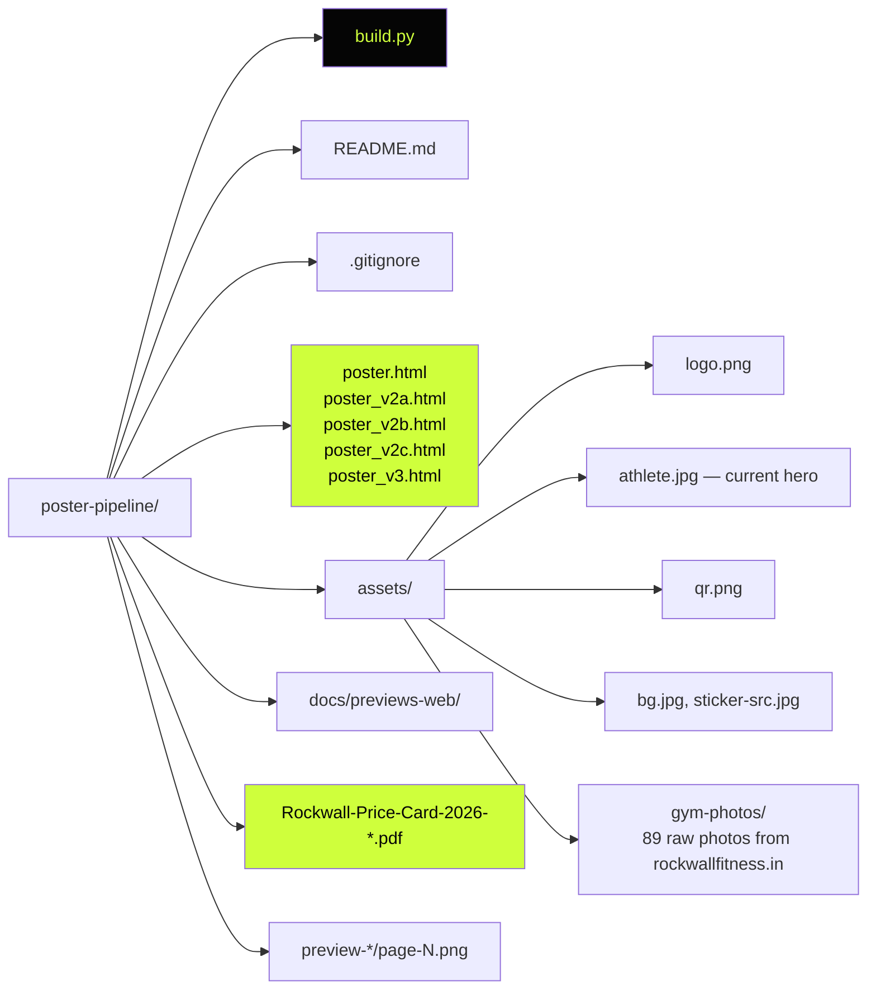

---

## Render commands

```bash
# Install deps once
pip3 install weasyprint qrcode[pil] Pillow

# Render the synthesis pick
python3 build.py poster_v3.html

# Render any other variant
python3 build.py poster_v2b.html

# Default — renders poster.html (v1)
python3 build.py

# Regenerate the QR (only needed if QR target URL changes)
python3 build.py poster_v3.html --regen-qr
```

Each run produces:
- `Rockwall-Price-Card-2026-<variant>.pdf` — press-ready
- `preview-<variant>/page-N.png` — 200 DPI PNG render per page, for review

---

## Print export spec

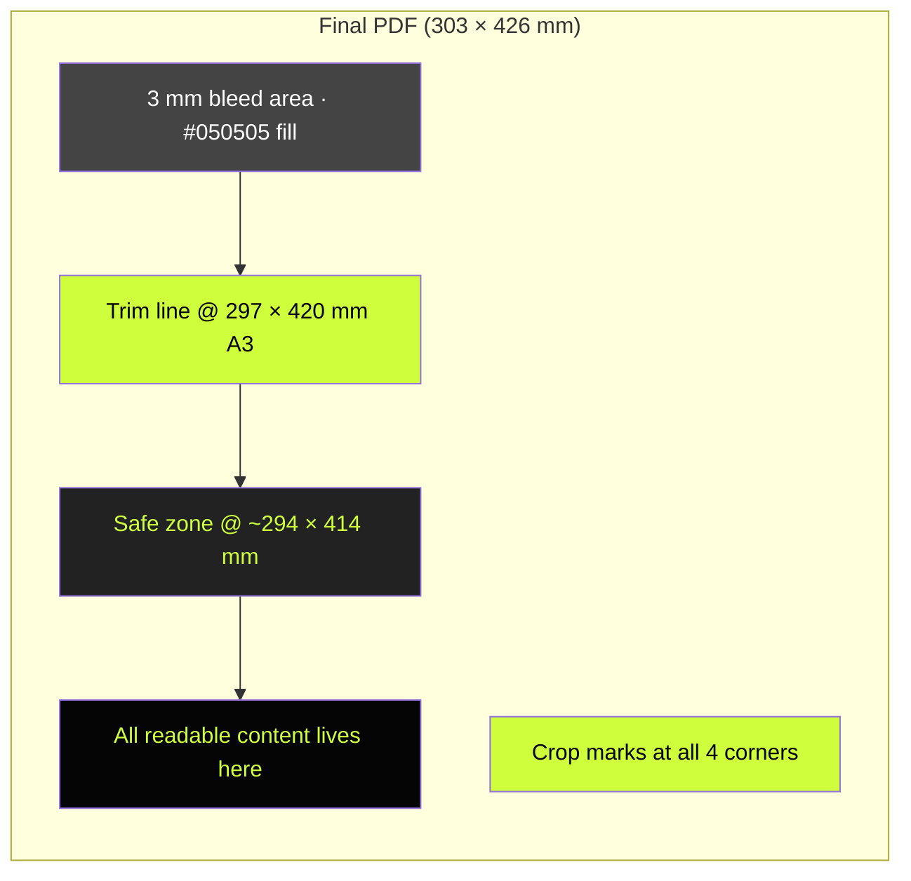

| Spec | Value |
|---|---|
| Trim size | 297 × 420 mm (A3) |
| Bleed | 3 mm all sides → final PDF is **303 × 426 mm** |
| Crop marks | Auto-emitted at corners (`marks: crop cross`) |
| Background bleed | `@page { background: #050505; }` — no white edge after trim |
| Colour profile | sRGB (do **not** pre-convert to CMYK; printer's RIP handles it) |
| Image encoding | JPEG quality 95, no chroma subsampling, baseline |
| Hero photo | Source 1600×1067 → Lanczos-upscaled to 3200×2134 + unsharp mask + 8% contrast boost → ~270 DPI effective at hero band size |
| PDF variant | **PDF/A-3b** (archival print-safe) |
| Rasterisation DPI | 300 (for CSS-rendered effects: gradients, filters) |
| File size | v3 = 3.1 MB · v2b = 2.5 MB · others 0.4–0.7 MB |

**Send straight to printer.** Tell them: A3, 3 mm bleed, trim to marks.

---

## How to start a new poster project

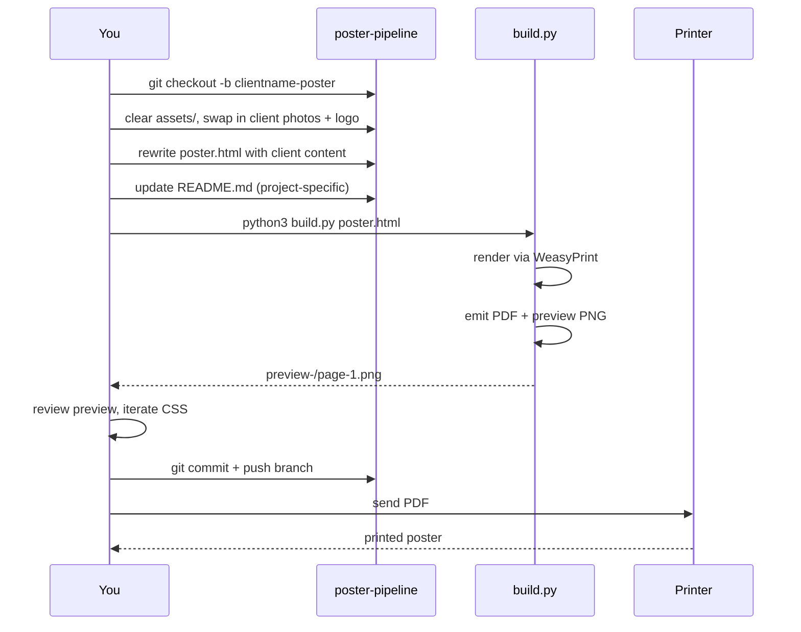

Concrete steps:

```bash
# 1. New branch for the new client
git checkout -b acme-gym-poster

# 2. Clear out the Rockwall assets, drop in the new ones
rm -rf assets/gym-photos preview-* Rockwall-Price-Card-*.pdf
# (Keep build.py, .gitignore, poster.html as the starter)

# 3. Edit poster.html — swap copy, swap colours, swap photos
# 4. Edit assets/qr.png to point at the new URL
# 5. Build
python3 build.py poster.html

# 6. Iterate. When happy:
git add . && git commit -m "Seed acme-gym poster v1"
git push -u origin acme-gym-poster

# 7. Update this README to describe the new project
#    (per branch-per-project convention below)
```

---

## Branch-per-project model

Per [Piyush Mishra](https://piyushmishra.online)'s repo convention: **each branch is a distinct project**. The README on each branch is project-specific — it describes whatever poster lives on that branch, not a global "this is what poster-pipeline does" overview.

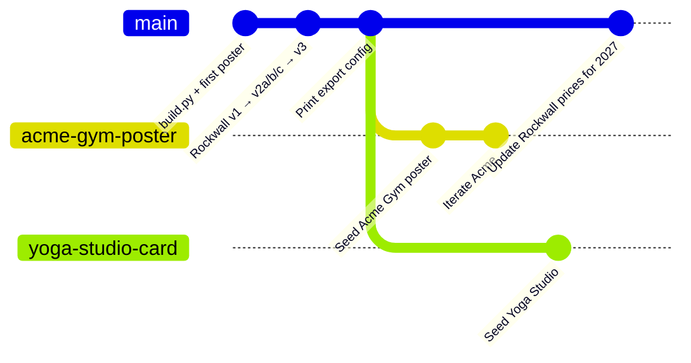

The `main` branch always carries the **current Rockwall work** (since Rockwall is the seed/example). Sub-branches carry other clients. This keeps the build pipeline shared (any improvement to `build.py` lives in `main` and gets merged into client branches) while letting each project's content stay isolated.

---

## WeasyPrint gotchas (learned the hard way)

WeasyPrint silently drops several modern CSS properties — pages render wrong without any error. These ones bit during this project:

### ❌ DROPPED (do not use)

| Property | What to use instead |
|---|---|
| `inset: 0` shorthand | Explicit `top: 0; right: 0; bottom: 0; left: 0;` (this caused **two** "image not rendering" bugs in v3) |
| `display: contents` | Flatten the HTML so children become direct grid/flex items |
| `mix-blend-mode` | Fake with opacity overlays + duotone filters |
| `backdrop-filter` | Unsupported entirely |
| `filter: drop-shadow()` | Use `box-shadow` or SVG `<feDropShadow>` |
| `text-shadow` | Unsupported |

### ✅ SUPPORTED (use freely)

- `filter: grayscale() contrast() brightness()` on images — works great for duotone/halftone treatments
- `clip-path: polygon(...)` — torn-paper edges, complex shapes
- `linear-gradient`, `radial-gradient`, `repeating-linear-gradient` — scan lines, vignettes
- `transform: scale/rotate/translate` with mm units
- `font-variation-settings: "wdth" 150` on variable fonts (Anybody) — but the Google Fonts URL must include the wdth axis: `Anybody:ital,wdth,wght@0,75..150,400..900`
- `@page { size, margin, bleed, marks, background }` — full print export with bleed + crop marks works

### Debug technique

If an image doesn't render but the file is valid → check whether its containing div has zero dimensions because an `inset:` was silently dropped. Also try re-encoding progressive JPEGs to baseline (`Image.save(..., progressive=False)`) — some WeasyPrint versions choke on progressive JPEG.

### Print-export incantation (in `build.py`)

```python
HTML(filename=str(html), base_url=str(HERE)).write_pdf(
    target=str(pdf),
    dpi=300,
    jpeg_quality=95,
    full_fonts=True,
    pdf_variant="pdf/a-3b",
)
```

Paired with:

```css
@page {
  size: 297mm 420mm;
  margin: 0;
  bleed: 3mm;
  marks: crop cross;
  background: #050505;
}
```

You get a 303×426 mm PDF with auto crop marks, bleed area filled with brand colour, archival print-safe.

---

## Credits

- **Concept + iteration:** Piyush Mishra ([SMARK8ING](https://smark8ing.com))
- **Build pipeline + execution help:** Claude (Anthropic) via Claude Code
- **Photography:** Rockwall Fitness in-house (`assets/gym-photos/`)
- **Fonts:** Anybody, Inter Tight, JetBrains Mono, Archivo Black, Departure Mono, Bricolage Grotesque — all Google Fonts under OFL
- **Engine:** [WeasyPrint](https://weasyprint.org/) (HTML → PDF)
- **QR generation:** [`qrcode`](https://pypi.org/project/qrcode/) Python library

---

<p align="center"><sub>Branch: <code>main</code> · Project: Rockwall Fitness 2026 Price Card · Last updated: 2026-05-27</sub></p>
